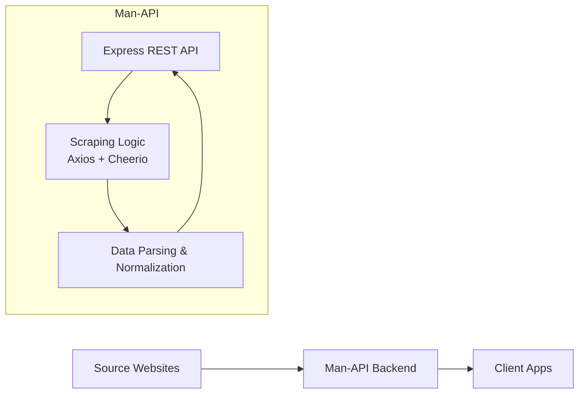
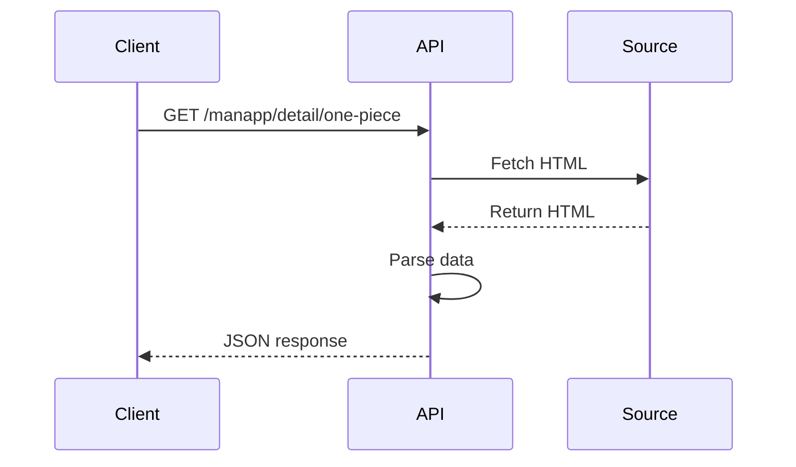

# Man-API
REST API to fetch Manga/Manhwa/Manhua data in Bahasa Indonesia powered by a custom scraping pipeline.

Man-API is a backend service built to aggregate manga data from a public source, normalize the structure, and expose it through a clean REST API for mobile applications (specifically the [Manapp](https://github.com/abdullahhalis/manapp) reader application).

This project demonstrates backend engineering skills including scraping architecture, API design, data transformation, and deployment constraints.

---

## ✨Features
- Manga metadata scraping
- Chapter list extraction
- Chapter reader image extraction
- Search functionality
- REST API architecture
- Consistent JSON responses
- Slug-based routing
- Swagger documentation
- Cloud deployment

---

## 🚀 Base URL

```
https://man-api-umber.vercel.app/
```
### API Documentation
```
https://man-api-umber.vercel.app/api-docs
```
>⚠️ Note <br>
>Some API endpoints may occasionally fail due to IP blocking from source websites (anti-scraping protection). The documentation endpoint remains accessible. This is a known limitation of scraper systems deployed on shared cloud infrastructure.

---

## 📚 Endpoints
| Method | Endpoint | Description |
|--------|----------|-------------|
| GET | [/api-docs](https://man-api-umber.vercel.app/api-docs) | Interactive API documentation |
| GET | [/manapp](https://man-api-umber.vercel.app/manapp) | Fetch latest & popular manga |
| GET | [/manapp/search](https://man-api-umber.vercel.app/manapp/search?s=one&page=1) | Search manga by keyword |
| GET | [/manapp/detail/:slug](https://man-api-umber.vercel.app/manapp/detail/one-piece) | Fetch manga details by slug |
| GET | [/manapp/detail/:mangaSlug/:chapterSlug](https://man-api-umber.vercel.app/manapp/detail/one-piece/chapter-1163.653200) | Fetch chapter details by chapter slug |

### Example Requests (Search Manga)
```bash
curl -X GET https://man-api-umber.vercel.app/manapp/search?s=one%20piece&page=1
```
### Example Response:
```json
{
    "status": {
        "code": 200,
        "message": "success"
    },
    "data": [
        {
            "title": "One Piece",
            "chapter": "1178",
            "rating": "9",
            "image": "https://cdn.manga-source.com/images/one-piece.jpg",
            "slug": "one-piece"
        }
    ]
}
```

> ⚠️ Note <br>
>Routes currently use `/manapp` prefix as the API was originally built to support the Manapp mobile client. Future versions may generalize the route structure.

---
## 📦 Response Format
All responses follow a consistent structure:
```json
{
  "status": {
    "code": 200,
    "message": "success",
  },
  "data": {}
}
```
### Design considerations:
- Predictable structure
- Easy parsing for clients
- Error safety
- Future extensibility
---

## 🏗️ Architecture
System flow:




### Scraping Layer
Responsibilities:
- Extract manga metadata
- Extract chapter lists
- Extract reader images
- Handle pagination scraping
- Handle HTML structure inconsistencies

### Data Processing Layer
Responsibilities:
- Data normalization
- Field cleaning
- Slug generation
- Null safety mapping
- Response formatting

### API Layer
Responsibilities:
- REST endpoint exposure
- Query handling
- Error handling
- Response consistency
- Client optimization

### Request Flow Diagram


---

## 🛠️ Tech Stack
### Backend
- Node.js
- Express.js

### Scraping
- Cheerio
- Axios

### Documentation
- Swagger

### Deployment
- Vercel

---

## ⚙️ Design Decisions
### Why scraping instead of public APIs?
Reasons:
- Most free manga APIs are unreliable
- Data structures are inconsistent
- Limited chapter availability
- No control over schema

Scraping allows:
- Full schema control
- Data normalization
- Consistent structure
- Learning real backend problems

### Why REST instead of GraphQL?
Reasons:
- Simpler mobile integration
- Faster implementation
- Easier debugging
- Predictable responses

---

## 🧠 Real-World Engineering Challenges
Building this project introduced practical backend challenges:

### Anti-Scraping Protection
Issues encountered:
- Cloud IP blocking
- Bot detection systems
- Request rate limits
- Temporary access denial

### Infrastructure Constraints
Serverless deployment limitations:
- Shared IP ranges
- No background workers
- Cold start delays
- Limited execution time

### Data Reliability Issues
Scraping problems:
- HTML structure changes
- Missing fields
- Lazy loaded images
- Broken image hosts

---

## 🔧 Mitigation Strategies
Solutions implemented or explored:
- Custom request headers
- Retry mechanism
- Defensive parsing strategy
- Delay between requests
- Null safety mapping

Potential production solutions:
- Rotating proxy pool
- Redis caching layer
- Background scraping jobs
- Database persistence
- Queue workers
- Dedicated VPS deployment

---

## ⚠️ Known Limitations
Current limitations:
- No caching layer
- No database persistence
- Depends on source HTML structure
- No rate limiting yet
- No authentication
- Serverless scraping constraints

This project is intended as a learning architecture rather than a production scraper.

---

## 🎯 What This Project Demonstrates
Technical capabilities shown:
- REST API design
- Web scraping architecture
- Data normalization
- Failure handling
- Infrastructure awareness
- Backend tradeoff decisions
- Client-oriented API design

---
## 📈 Future Improvements
Planned improvements:
- Redis caching
- Rate limiting
- Background scraping scheduler
- Database integration
- Monitoring & logging
- Source failover strategy
- Content indexing
- Recommendation engine

---
## 📱 Related Project
Mobile client: [Manapp](https://github.com/abdullahhalis/manapp)

---

## 📚 Lessons Learned
Key takeaways from building this project:
- Scraping reliability is harder than scraping itself
- Data consistency is harder than data collection
- Backend must assume failure cases
- Infrastructure affects scraper stability
- API design should simplify client complexity

---
## ⚠️ Disclaimer
This project is an unofficial scraper API.
- Not affiliated with any publisher
- Not affiliated with any manga provider
- For educational purposes only
- Demonstrates scraping & backend architecture concepts

All rights belong to their respective content owners.

Please respect original content owners.
